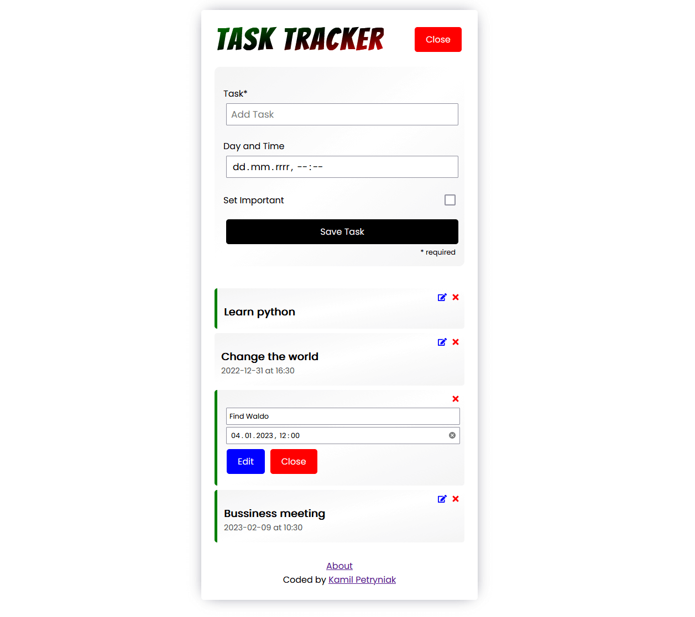

# Task tracker

Task-tracking app created with React and JSON Server. Saves tasks in JSON databse.

# About

Simple task tracking app. Add your task and track them, delete when they
are done. Make task more visible by setting important label when
creating task or double click on existing one. Edit added task by clicking edit button.

# Features

- Add task text
- Add task date
- Add important label
- Edit task
- Toggle important label
- Save tasks in local database with JSON Server

# Setup

Download project, install packages, run frontend server and run json-server.

'''
cd .
npm install
...
npm start
///open new terminal///
npm run server
'''
